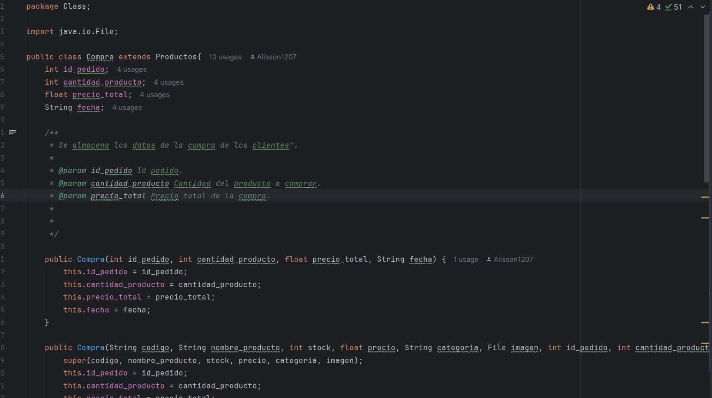
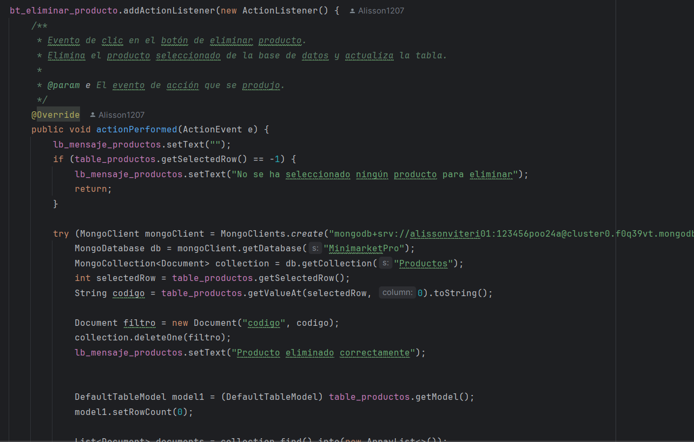

# Escuela Politecnica Nacional

## Autor

- Alisson Viteri
## Minimarket Pro
### Descripción del Proyecto
Es un sistema integral diseñado para optimizar las operaciones diarias en un minimarket. Este sistema facilita la gestión de ventas, control de inventario y administración de usuarios mediante una solución integrada en Java.

### Objetivo
El objetivo principal de MiniMarketPro es proporcionar una plataforma que simplifique las tareas cotidianas en un minimarket, incluyendo la gestión de transacciones, el control de stock, y la administración de usuarios.

## Estuctura del Proyecto

## Clases Principales
El sistema está diseñado utilizando los principios de Programación Orientada a Objetos (POO).

### Compra
Representa una transacción de compra en el sistema. Registra detalles como el identificador del pedido, la cantidad de producto, el precio total y la fecha de la compra.

#### Funcionalidad
Esta clase hereda de la clase Productos, permitiendo obtener la información del producto al realizar la compra.

### Personal
En esta clase se realiza el registro de los usuarios gestionando sus roles y permisos dentro del sistema.

### Productos
Maneja la información de los productos en inventario, incluyendo el nombre del producto y su respectiva imagen, además proporciona métodos para su gestión.

### Ventas
Registra las ventas realizadas, asociando la venta con el cajero que la realizó. Incluye información sobre el número de venta y la fecha.

#### Funcionalidad
Hereda de la clase Personal, permitiendo vincular cada venta con el usuario que la registró.

## Base de Datos
* MongoDB Atlas: Utilizado para almacenar datos en la nube.
#### Colecciones
* Ventas: Almacena información sobre las transacciones de venta.
* Productos: Contiene datos sobre los productos y su stock.
* Usuarios: Registra la información de los usuarios del sistema.

## Librerías
* iText PDF (versión 5.5.9): Utilizada para la generación de notas de venta en formato PDF.

## Vistas
* Login: Interfaz para el inicio de sesión de usuarios.

En esta Ventana se realizo la conección con Atlas, además de el proceso de autenticación 
de las credenciales, si su rol era "Administrador" se muestra el panel del administrador
de la misma manera en el caso de que el rol sea "cajero".

* Cajero: Vista para la gestión de ventas y visualización del catálogo de productos.

El Diseño cajero fue realizado con un menú de pestañas para facilitar el acceso,
este menú presenta el catalogo de los productos registrados, se clasificaron por categorías:
Bebidas, Snacks, Carnes, Lacteos, Panadería y verduras.

Una vez seleccionado los productos serán agregados al apartado "Carrito", en donde
se encuentra botones para: eliminar productos, editar cantidad del producto,
finalizar compra y generar factura, que fueron realizados con los respectivos
métodos.

Para generar factura en formato pdf se importo la librería itext.pdf y se realizo 
el diseño respectivo de la factura.

Se realizó un método para obtener el nombre del cajero que realizo la venta mediante la cedula.

* Administrador: Vista para la gestión de productos, usuarios y ventas.

Para la interfaz del "Administrar" se realizó de igual forma con un menu con: 
* Registro Usuarios
* Ingreso Productos 
* Ventas

### Registro Usuarios
* Validación de campos vacíos
* Validación del formato fecha 

Para el registro se realizó la conección en l base de datos con respectivos
campos y se muestra en una tabla.

El registro cuenta con botones para editar, elminar, y buscar a los usuarios.

### Ingreso Productos
Esta interfaz permite el registro de los productos, subir la imagen del producto, stock y 
precio, se implementó los botones de editar, eliminar y buscar productos; los 
productos se pueden buscar o filtrar de dos maneras ya sea por el código del 
producto o por categorís.

### Ventas
En la parte de ventas se realizo un filtro para que me muestre las ventas de cada
uno de los vendedores y estas buscan mediante el número de cedula del cajero y se mostrará
en una tabla.

Tambien permite visualizar todas las ventas realizadas.

Link del video: https://youtu.be/dZeQZVfAh1c 

